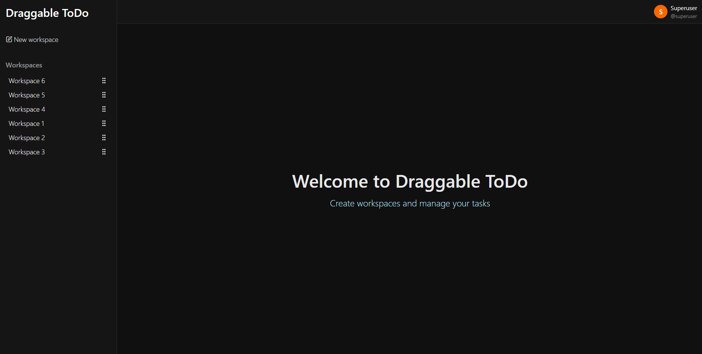
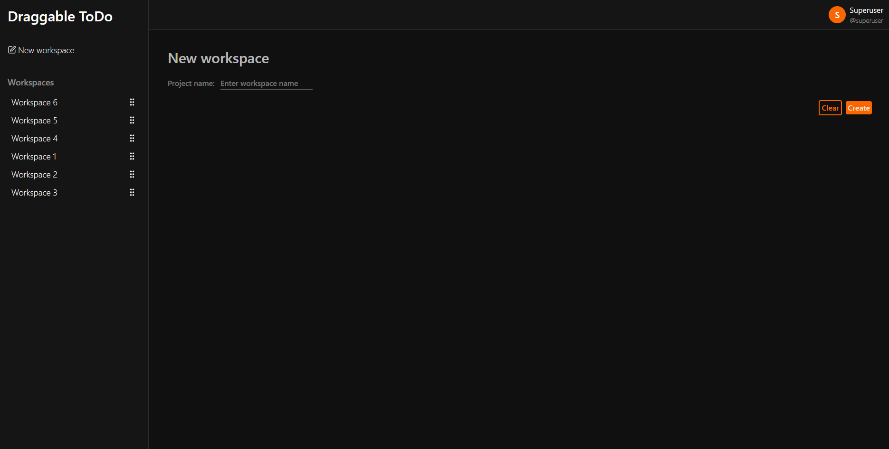

<p align="center">
    
    
    
    
    
    
    
    
    
</p>

# Draggable To Do

**Draggable To Do** to platforma służąca do zarządzania swoimi zadaniami. W łatwy i przystępny sposób możesz tworzyć nowe "**_Obszary robocze_**" tzw. "**_Workspace'y_**", tworzyć i przeciągać zadania oraz zarządzać widocznością kolumn w obszarze roboczym.

<details>
<summary>Screenshoty</summary>
<ul style="list-style:none">

<li>

### Akcje użytkownika

<div align="center">
    
    
</div>
</li>

<li>

### Po zalogowaniu





</li>

<li>

### Przeciąganie zadań


</li>

</ul>
</details>

## Wymagania do uruchomienia

- PHP 8.3+
- Composer 2.8.8+
- MySQL 9.3+
- Node.js 22+

## Lokalne uruchomienie aplikacji

1. Sklonuj repozytorium

```bash
git clone https://github.com/kacper-wladarz/Draggable-ToDo.git
cd Draggable-ToDo
```

2. Stwórz i ustaw token Github

Wejdź na stronę https://github.com/settings/tokens/new i wygeneruj token. Następnie wklej go do poniższej komendy

```bash
composer config -g github-oauth.github.com <TOKEN>
```

3. Zainstaluj zależności PHP

```bash
composer install
```

4. Zainstaluj zależności JS

```bash
npm install
```

5. Przygotuj plik środowiskowy (.env)

```bash
php artisan env:prepare
```

6. Uruchom server lokalnie

```bash
npm run full-dev
```

7. Uruchomienie testów

```bash
php artisan tests:run
```

## Struktura projektu

```
resources/app/     React (frontend)
app/               Laravel (backend)
```
